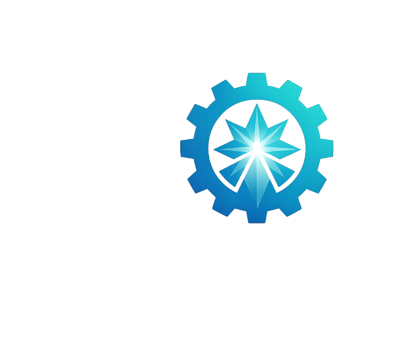
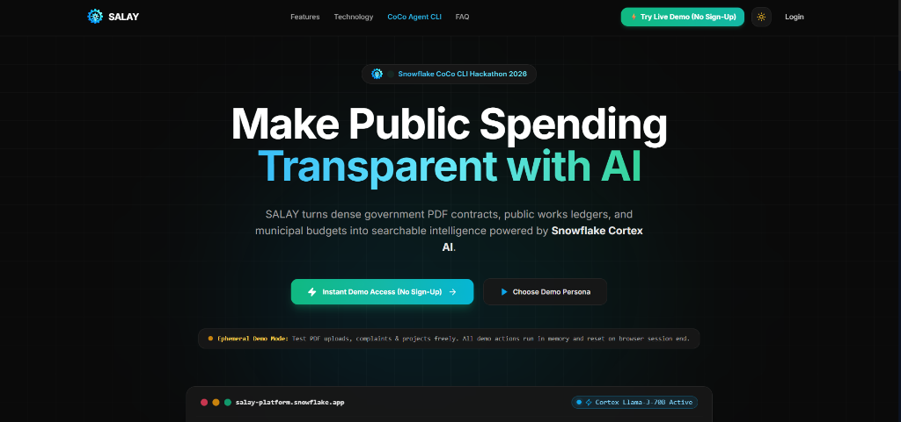
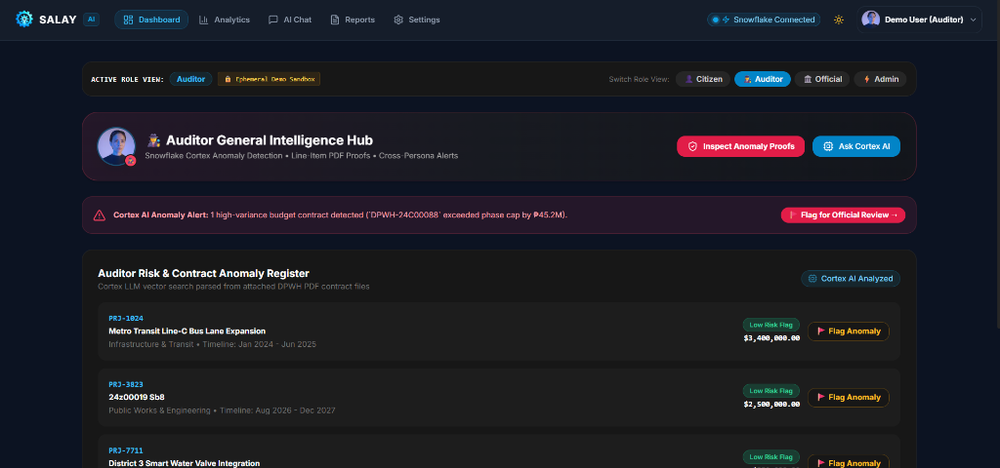
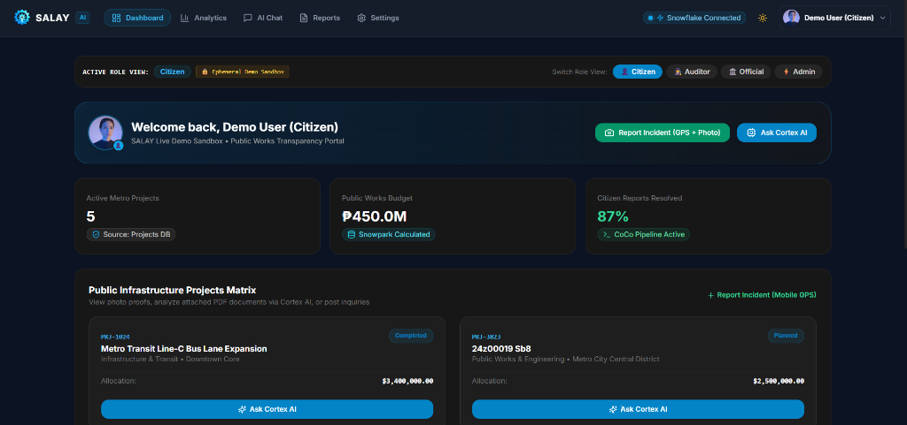
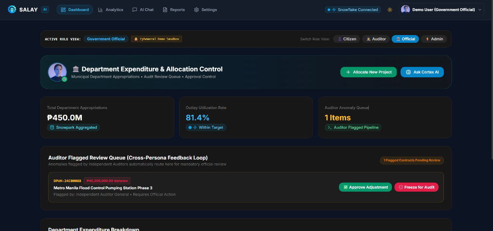
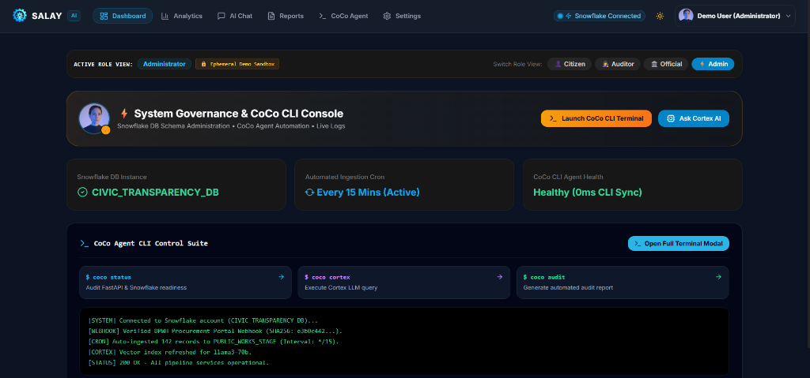

# SALAY — The Civic Transparency Engine 🔎

<p align="center">
  
</p>

**Snowflake CoCo CLI Hackathon 2026**


SALAY is an **AI-Native Data Application** designed to bring absolute transparency to civic operations. By combining unstructured data extraction with natural language querying, SALAY empowers citizens and auditors to instantly understand complex government contracts and public works budgets.

---

## 🎯 Problem Statement
Public works contracts, infrastructure budgets, and government expenditures are often buried in dense, multi-page PDF documents. Citizens, journalists, and independent auditors struggle to extract meaningful insights without legal or financial expertise. This lack of accessibility breeds mistrust and shields corruption.

**The Solution:**
SALAY serves as a bridge between complex civic data and public transparency. Using **Snowflake Cortex AI**, the platform ingests unstructured PDF contracts (like DPWH projects), instantly extracts key concepts (Budgets, Currencies, Departments), and allows users to "chat" directly with the civic data using natural language. 

---

## 📸 Screenshots & Role Views Showcase

### 1. First: Landing Page
*Modern, high-impact landing page featuring Snowflake CoCo CLI branding, tech stack matrix, and instant 1-click live demo entry.*



---

### 2. Second: Auditor Dashboard
*Forensic Crimson Rose theme featuring Cortex AI high-variance budget anomaly alerts, line-item PDF contract proof inspector, and Snowflake SQL vector search.*



---

### 3. Third: Citizen Dashboard
*Public works transparency matrix, mobile photo proofs, plain English Cortex AI chat assistant, and anonymous whistleblower incident reporting.*



---

### 4. Fourth: Government Official Dashboard
*Executive Emerald theme displaying municipal department appropriations, outlay utilization rates, and the Auditor Anomaly Review Queue.*



---

### 5. Fifth: Admin Dashboard
*System Governance and CoCo CLI Control Suite (`coco status`, `coco cortex`, `coco audit`), Snowflake DB schema diagnostics, and real-time ingestion logs.*



---

## ❄️ Snowflake Usage

SALAY is built natively on the Snowflake AI Data Cloud:

1.  **Snowflake Cortex AI**: Powers the core document intelligence and natural language chat interface (using `llama3-70b`, `llama3.1-405b`, and `mistral-large`).
2.  **Snowpark**: Used to manipulate and analyze tabular budget data in the backend securely.
3.  **Snowflake Database**: Acts as the primary transactional datastore for structured project metadata (`CIVIC_TRANSPARENCY_DB`).
4.  **CoCo CLI**: Embedded command-line execution and reasoning router (`/api/v1/cli/execute`) for backend automation and status checks.

---

## 🏗️ Architecture & Tech Stack

SALAY uses a highly decoupled Clean Architecture designed for enterprise scalability.

*   **Frontend**: React 18, Vite, TypeScript, Tailwind CSS, shadcn/ui.
*   **Backend**: FastAPI, Python 3.11, Pydantic.
*   **Data & AI**: Snowflake Connector for Python, Snowpark, Cortex LLMs.
*   **Design System**: Vercel/Linear-inspired glassmorphic UI, responsive fluid grid layouts.

---

## 🚀 Installation & Environment Setup

### Prerequisites
*   Python 3.11+
*   Node.js v20+
*   Snowflake Trial or Enterprise Account

### 1. Clone the Repository
```bash
git clone https://github.com/zneright/salay.git
cd salay
```

### 2. Environment Configuration
Duplicate the `.env.example` files in both the frontend and backend directories.

**Backend (`backend/.env`)**
```env
USE_SNOWFLAKE=true
SNOWFLAKE_ACCOUNT=your_account
SNOWFLAKE_USER=your_user
SNOWFLAKE_PASSWORD=your_password
CORTEX_MODEL=llama3-70b
```

**Frontend (`frontend/.env`)**
```env
VITE_API_URL=http://localhost:8000
VITE_USE_MOCK=false
```

---

## 🏃‍♂️ Running Locally

SALAY features an automated setup script for Windows PowerShell:

```powershell
.\scripts\setup.ps1
```

Alternatively, you can run the servers manually:

**Terminal 1: Start the Backend (FastAPI)**
```bash
cd backend
python -m venv venv
venv\Scripts\activate
pip install -r requirements.txt
python run.py
```
*API docs available at: http://localhost:8000/docs*

**Terminal 2: Start the Frontend (Vite/React)**
```bash
cd frontend
npm install
npm run dev
```
*App available at: http://localhost:5173*

---

## 🤝 Acknowledgements

*   Built for the **Snowflake CoCo CLI Hackathon 2026**
*   Hosted by **Hack2Skill**

---

## 📄 License
This project is open-source and licensed under the MIT License.
